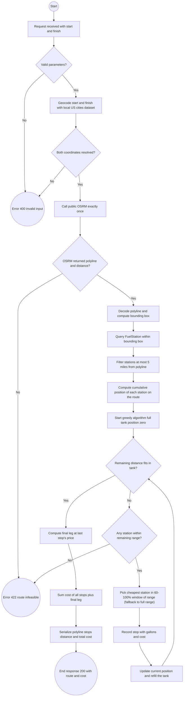
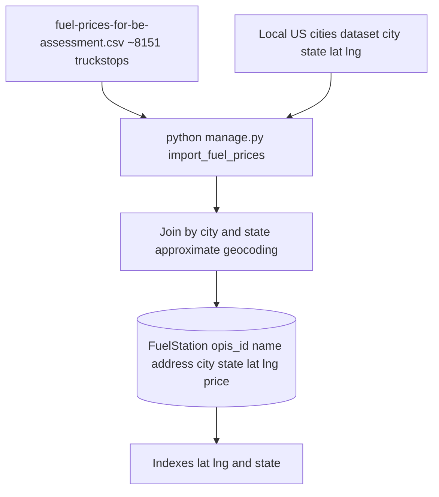

# Fuel Route Optimizer API — Executive Planning

Planning document. It does not describe finished implementation; it describes the intended flow for the "Remote Backend Django Engineer" challenge.

## Main Premise

The API takes two US locations (origin and destination) and returns the route, the optimal fuel stops and the total fuel cost. The vehicle has a 500-mile range at 10 miles per gallon, and prices are read from the provided CSV (`fuel-prices-for-be-assessment.csv`, ~8,151 truckstops).

The external routing API integration must be minimized: a single call per request is ideal, up to three is acceptable. The design therefore assumes data pre-processing (CSV geocoding) and local geometric calculations to pick stops, with no new external calls during optimization.

The runtime flow starts when the HTTP request lands:

```text
GET /api/route/?start=<origin>&finish=<destination>
 -> Geocoder (local -> Photon as fallback)
 -> Public OSRM (1 call: polyline + distance)
 -> SQLite FuelStation (candidates within bounding box)
 -> Greedy H2 optimizer (60-100% of range, H1 fallback)
 -> JSON response (route_polyline + Google Maps view_url + fuel_stops)
```

## Executive Diagram

```mermaid
sequenceDiagram
    autonumber
    participant Client as "Postman Client"
    participant API as "Django REST API"
    participant Geo as "Local Geocoder"
    participant OSRM as "Public OSRM"
    participant DB as "SQLite FuelStation"
    participant Opt as "Greedy Optimizer"
    participant Resp as "Response Builder"

    Client->>API: "GET /api/route start finish"
    API->>Geo: "Resolve start and finish to lat lng (local dataset first Photon as fallback)"
    Geo-->>API: "Origin and destination coordinates"

    Note over API,OSRM: "Only external call in the flow"

    API->>OSRM: "GET route v1 driving lon1 lat1 lon2 lat2 overview full geometries polyline"
    OSRM-->>API: "Encoded polyline and total distance in meters"

    API->>API: "Decode polyline and convert distance to miles"
    API->>DB: "Select FuelStation within the route bounding box"
    DB-->>API: "List of raw candidates"

    API->>API: "Compute perpendicular distance to the polyline with 5-mile buffer"
    API->>API: "Compute cumulative position in miles from origin"

    API->>Opt: "Run greedy H2 tank 500 MPG 10 window 60-100%"
    Opt-->>API: "Ordered list of stops and total cost"

    API->>Resp: "Build payload with polyline view_url Google Maps stops distance and cost"
    Resp-->>Client: "JSON with route stops cost and map link"
```

## Planned Operational Flow



## Data Load Pipeline

The CSV load happens exactly once via a management command, before the API serves requests. There are no external calls during the load: geocoding uses a local US cities dataset (city, state -> lat, lng), which keeps cost zero and speed constant.



## Stop Selection Algorithm

The core of the challenge is choosing fuel stops along the route while minimizing total cost. The algorithm is greedy and runs entirely in memory, with no further external calls:

```text
Input: route polyline, total distance D in miles
Constants: tank T = 500 miles, efficiency MPG = 10
Output: ordered stops and total cost in USD

position = 0
remaining_range = T  (full tank at departure)
stops = []

while position + remaining_range < D:
    window = stations where
        perpendicular_distance(station, polyline) <= 5 miles
        position < cumulative_position(station) <= position + remaining_range
    if window is empty:
        return 422 route infeasible with 500-mile tank
    best = min(window, key = price_per_gallon)
    gallons_to_reach = (cumulative_position(best) - position) / MPG
    stops.append(best, gallons_to_reach, cost = gallons_to_reach * price)
    position = cumulative_position(best)
    remaining_range = T

final_gallons = (D - position) / MPG
total_cost = sum(stop.cost) + final_gallons * last_stop_price
```

The active heuristic (H2) restricts the window to 60-100% of the range, with automatic fallback to the full range (H1) when the preferred window is empty. See `DECISIONS.md` D11.

## Requirement Coverage

| INSTRUCTIONS.md requirement | How it is met |
|---|---|
| API on the latest stable Django | Django 6.0.5 (validated at djangoproject.com/download on 2026-05-27) |
| Start and finish inputs in the USA | Endpoint `GET /api/route/?start=&finish=` with offline geocoding + Photon (OSM) fallback for full addresses |
| Returns a map of the route | `route_polyline` (Google polyline) + `view_url` (Google Maps Directions with each stop as a waypoint, opens in miles) |
| Returns optimal fuel stops | `fuel_stops` field with name, address, lat, lng, price, gallons, cost and miles from origin |
| 500-mile maximum tank | Optimizer constant, multiple stops supported |
| Returns total cost | `total_cost_usd` field computed from the chosen stops |
| 10 MPG | Optimizer constant in the miles-to-gallons conversion |
| Uses the provided CSV | `import_fuel_prices` management command loads the CSV into SQLite |
| Free map/route API found by the candidate | Public OSRM at `router.project-osrm.org`, no API key |
| Fast API | CSV pre-geocoding, SQLite index, single query and local geometric computation |
| One call ideal, up to three acceptable | One OSRM call per request; Photon only fires when offline geocoding fails |
| 3-day delivery | Lean scope, one endpoint, one management command, no frontend |
| 5-minute Loom with Postman | Postman/Insomnia/Bruno collection ready and recording script in `PRESENTATION.md` |
| Share code | Git repository ready to push |

## Response Format

The response is a single JSON document, sufficient to render the map in any web client and show operational detail to the user:

```json
{
  "start": {"address": "Houston, TX", "lat": 29.76, "lng": -95.36},
  "finish": {"address": "Boston, MA", "lat": 42.36, "lng": -71.05},
  "total_distance_miles": 1845.3,
  "total_gallons": 184.53,
  "total_cost_usd": 587.42,
  "route_polyline": "encoded_polyline_string",
  "view_url": "https://www.google.com/maps/dir/?api=1&origin=29.76,-95.36&destination=42.36,-71.05&waypoints=...&travelmode=driving",
  "view_url_osrm": "https://map.project-osrm.org/?z=4&center=36.06,-83.21&loc=29.76,-95.36&loc=...&loc=42.36,-71.05&srv=0",
  "fuel_stops": [
    {
      "name": "PILOT TRAVEL CENTER #1243",
      "address": "I-8, EXIT 119 & SR-85",
      "city": "Gila Bend",
      "state": "AZ",
      "lat": 32.95,
      "lng": -112.72,
      "price_per_gallon": 3.899,
      "gallons": 48.5,
      "cost": 189.10,
      "miles_from_start": 485.0
    }
  ]
}
```

## Risks and Mitigations

| Risk | Mitigation |
|---|---|
| Public OSRM is limited to 1 req/s and has no SLA | In-memory cache per origin/destination pair with TTL; document how to swap for self-hosted OSRM or OpenRouteService with a free key |
| CSV does not include truckstop lat/lng | Approximate geocoding by city and state using a local US cities dataset; precision sufficient for corridor selection |
| Routes where no station is within remaining range | Returns HTTP 422 with the clear `route_infeasible_with_range` message |
| 5-mile perpendicular buffer can capture stations on the wrong side of the highway | Acceptable for the challenge; future refinement would project the station onto the nearest segment and validate direction |
| Ambiguous input address (same city name across multiple states) | Require the `City, ST` format and document it in the README and the Postman collection |

## Final Stack

| Layer | Choice | Justification |
|---|---|---|
| Web framework | Django 6.0.5 | Latest stable validated at djangoproject.com/download (2026-05-27); supported through Apr/2027 |
| API | Django REST Framework | Industry standard, serializers and validation built in |
| Database | SQLite | Zero setup, sufficient for scope; trivial migration to Postgres |
| Routing | Public OSRM `router.project-osrm.org` | Free, no key, returns polyline and distance in one call |
| Geocoding | Local US cities dataset (SimpleMaps free) | Offline, zero cost, sufficient for city/state granularity |
| Geometry | `polyline` for decoding, pure haversine for distance | No heavy dependencies, predictable performance |
| HTTP client | `requests` | Industry standard |

## Pre-Implementation Decision Points

| Decision | Options | Recommendation |
|---|---|---|
| Django version | 6.0.5 latest or 5.2 LTS | 6.0.5 (matches the literal interpretation of "latest stable") |
| Routing provider | Public OSRM or OpenRouteService with key | Public OSRM for simplicity, no signup |
| Database | SQLite or Postgres | SQLite for challenge scope |
| Optimizer heuristic | "Cheapest in range" or "Cheapest in 60 to 100 percent window" | Implement the first, compare against the second in a benchmark |
